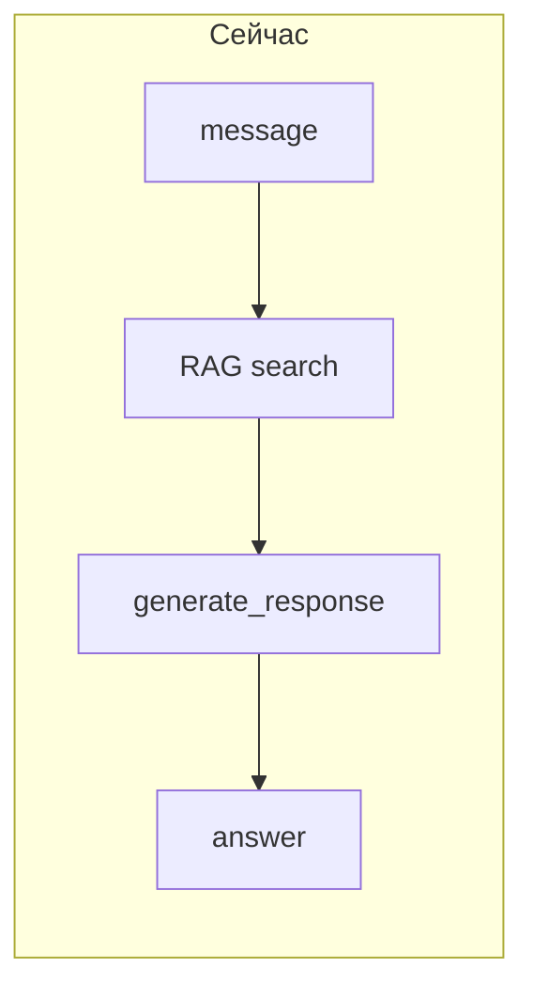
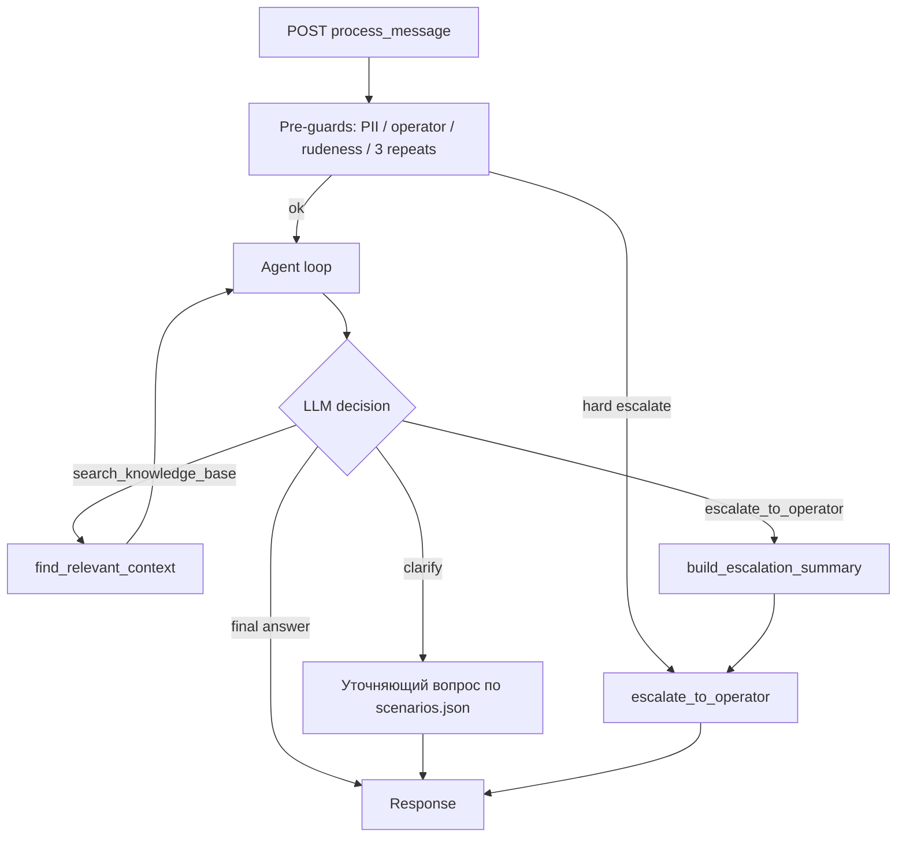
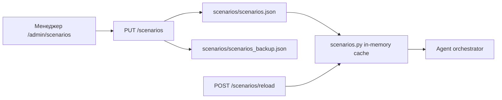

# Агент с RAG и эскалацией

## Текущая проблема

Сейчас в [`app/api/process.py`](app/api/process.py) пайплайн жёстко линейный: **всегда** `find_relevant_context()` → **один** вызов `generate_response()` в [`app/services/response.py`](app/services/response.py). Агент не решает, когда уточнять, когда искать в KB, когда эскалировать.



## Целевая архитектура



**Гибридная эскалация** (по вашему выбору):
- **Жёстко до агента**: явный запрос оператора (`OPERATOR_KEYWORDS`), хулиганство/мат (категория из [`app/services/constants.py`](app/services/constants.py)), 3 повтора одного вопроса
- **Через tool агента**: нет релевантного ответа в KB после поиска, неоднозначный запрос исчерпал лимит уточнений, вопрос вне сценариев

---

## 1. Схема сценариев — файл + UI-редактор

### Рекомендация: JSON как источник истины + Admin UI (в одном PR с агентом)

**Почему не PostgreSQL на старте:** сценариев немного (десятки, не тысячи), менеджеры редактируют редко, уже есть паттерн file-based admin (`/admin/kb`, `synonyms.json`). JSON проще версионировать в git, делать backup и hot-reload без миграций.

**Почему UI нужен:** бизнес-команда не должна править JSON вручную и деплоить ради смены уточняющего вопроса. UI снижает риск синтаксических ошибок и даёт предпросмотр.



### Хранение

Файл [`scenarios/scenarios.json`](scenarios/scenarios.json) (каталог `scenarios/`, volume в docker-compose по аналогии с `kb/`):

```json
{
  "version": 1,
  "updated_at": "14.06.2026 12:00",
  "scenarios": [
    {
      "id": "qr_issue",
      "enabled": true,
      "triggers": ["qr", "qr kod", "qr-код", "сканирование"],
      "required_slots": [
        {
          "id": "user_type",
          "question_ru": "Вы клиент мобильного приложения Paynet или агент, принимающий оплату?",
          "question_uz": "Siz Paynet mobil ilovasi foydalanuvchisiz yoki to'lov qabul qiluvchi agentsiz?"
        }
      ],
      "search_hint": "QR {user_type}",
      "max_clarifications": 2
    }
  ],
  "auto_escalate_categories": ["Хулиганство / Bezorilik"],
  "default_max_clarifications": 2
}
```

Стартовый набор (7 сценариев): `qr_issue`, `payment_failed`, `refund`, `sms_not_received`, `infokiosk`, `agent_payment`, `mobile_app`.

### Сервис [`app/services/scenarios.py`](app/services/scenarios.py)

- `load_scenarios()` — чтение JSON, in-memory cache (как [`synonyms.py`](app/utils/synonyms.py))
- `reload_scenarios()` — сброс кэша после сохранения из UI
- `validate_scenarios(data)` — Pydantic-модели: уникальные `id`, непустые triggers/questions, лимиты
- `match_scenario(query, language)` — поиск по triggers (enabled only)
- `get_missing_slots(scenario, agent_state)` — какие уточнения ещё нужны
- `build_search_query(scenario, slots)` — обогащённый запрос для RAG

### Admin API (Basic Auth, тот же `verify_admin` из [`admin.py`](app/api/admin.py))

| Endpoint | Назначение |
|----------|------------|
| `GET /scenarios/status` | file_exists, updated_at, count, backup_exists |
| `GET /scenarios` | полный JSON для редактора |
| `PUT /scenarios` | сохранить JSON (валидация → backup → write → reload) |
| `POST /scenarios/reload` | hot-reload без перезапуска бота |

Новый роутер [`app/api/scenarios_admin.py`](app/api/scenarios_admin.py) или расширение `admin.py`.

### Admin UI — `/admin/scenarios`

Страница по образцу [`/admin/kb`](app/api/admin.py) (inline HTML + JS, Basic Auth):

- **Список сценариев** — таблица: id, triggers, slots count, enabled toggle
- **Редактор сценария** — форма: triggers (tag input), вопросы ru/uz для каждого slot, search_hint, max_clarifications
- **Глобальные настройки** — auto_escalate_categories, default_max_clarifications
- **Кнопки**: «Сохранить», «Перезагрузить», «Добавить сценарий», «Удалить»
- **Валидация на клиенте** — обязательные поля; серверная Pydantic-валидация — финальный gate
- **JSON-режим** (опционально) — textarea для power-users, синхронизируется с формой

Ссылка с `/admin/kb`: «Управление сценариями агента».

---

## 2. История диалога и состояние в Redis

Расширить [`app/services/session.py`](app/services/session.py):

| Ключ | Содержимое |
|------|------------|
| `chat:{id}:agent_state` | JSON: `{scenario_id, slots, clarification_count, tools_used}` |
| `chat:{id}:messages` | Полная история `[{role, content, ts}]` — **user и assistant** (заменяет текущий `history` только из user-сообщений) |

### Лимит истории: 10 реплик

В [`app/core/config.py`](app/core/config.py): `MAX_HISTORY_SIZE = 10` — хранить **последние 10 сообщений** (user + assistant вперемешку). Этого достаточно для агента, уточнений и выжимки при эскалации.

Пример при 5 обменах: 5 user + 5 assistant = 10 записей (лимит).

Старый ключ `chat:{id}:history` (только user) — заменить на `messages` или писать в оба на переходный период для обратной совместимости API-поля `history` (только тексты user).

---

## 2.1. Выжимка при эскалации

**Требование:** при эскалации передавать не только `escalation: true`, а **краткую выжимку диалога** для оператора.

### Генерация — [`app/services/escalation.py`](app/services/escalation.py)

Новая функция `build_escalation_summary()`:

```python
async def build_escalation_summary(
    messages: list[dict],      # до 10 реплик из Redis
    agent_state: dict,
    classification: dict,
    language: str,
    reason: str,               # no_kb_match | user_request | ...
) -> str:
```

**Источники данных для выжимки:**
1. `chat:{id}:messages` — последние 10 реплик (основной источник)
2. `agent_state` — сценарий, заполненные slots (user_type, topic и т.д.)
3. `classification` — theme/category/subcategory
4. `reason` — почему эскалировали

**LLM-промпт** (gpt-4o-mini, синхронно при эскалации — не фоновая задача):
- Структурированный текст для оператора на русском (оператор читает ru; язык клиента — отдельным полем)
- Формат: «Тема / Тип клиента / Суть проблемы / Что уже сделал бот / Причина эскалации»
- Лимит: `ESCALATION_SUMMARY_MAX_CHARS = 1500` (config)

**Fallback** без LLM: склеить последние N реплик + classification + reason (если OpenAI недоступен).

Переиспользовать паттерн из [`context.py`](app/services/context.py), но вызывать **синхронно в момент эскалации** (не `schedule_context_update` — он асинхронный и может не успеть).

### Куда передаётся выжимка

| Место | Поле |
|-------|------|
| API `MessageResponse` | `escalation_summary: Optional[str]` — только при `escalation=true` |
| API `EscalateResponse` | `escalation_summary: Optional[str]` — при ручной эскалации |
| PostgreSQL `interactions` | в `classification` JSON: `{"...", "escalation_summary": "...", "escalation_reason": "..."}` |
| Redis (опционально) | `chat:{id}:escalation_summary` — на случай если фронт заберёт позже |

Пример ответа API:

```json
{
  "status": "escalation",
  "escalation": true,
  "escalation_summary": "Тема: QR-код. Клиент: агент. Проблема: QR не сканируется при приёме оплаты. Бот уточнил тип клиента, искал в KB — релевантного ответа нет. Эскалация: no_kb_match.",
  "response": "Передаём оператору. Пожалуйста, подождите."
}
```

Фронт колл-центра / CRM сможет показать оператору `escalation_summary` без чтения всей переписки.

---

## 3. Два инструмента агента

Новая папка `app/services/agent/`:

### `tools/search_kb.py`
- Обёртка над существующим [`find_relevant_context`](app/services/search.py)
- Принимает `query` (обогащённый сценарием), возвращает чанки + флаг `has_relevant_context` (пусто или все чанки нерелевантны → сигнал для эскалации)

### `tools/escalate.py` + [`app/services/escalation.py`](app/services/escalation.py)
- Вынести логику эскалации из [`process.py`](app/api/process.py) (строки 105–157)
- Переиспользовать в pre-guards, tool и `POST /escalate`
- Параметр `reason`: `no_kb_match`, `user_request`, `max_clarifications`, `rudeness`, `repeat`
- **Перед ответом клиенту** вызвать `build_escalation_summary()` и вернуть `EscalationResult(summary=..., response=..., escalation=True)`

### `registry.py`
- OpenAI tool schemas для `search_knowledge_base` и `escalate_to_operator`

---

## 4. Оркестратор агента

[`app/services/agent/orchestrator.py`](app/services/agent/orchestrator.py) — ядро:

```python
async def run_agent(ctx: AgentContext) -> AgentResult:
    messages = build_messages(system_prompt, history, scenarios, agent_state)
    for step in range(MAX_AGENT_STEPS):  # default 5
        response = await openai.chat.completions.create(
            model=AGENT_MODEL,  # gpt-4.1-mini
            messages=messages,
            tools=TOOL_SCHEMAS,
            tool_choice="auto",
        )
        if response.tool_calls:
            # execute tool, append result, continue loop
        else:
            return AgentResult(text=..., escalation=False, tools_used=...)
```

### System prompt (новый [`app/services/agent/prompts.py`](app/services/agent/prompts.py))

Ключевые правила для LLM:
1. Сначала определи сценарий по `scenarios.json`
2. Если есть `required_slots` без ответа — **задай уточняющий вопрос**, не вызывай RAG
3. Когда слоты заполнены — вызови `search_knowledge_base`
4. Если KB пуста / не отвечает на вопрос — вызови `escalate_to_operator`
5. Не выдумывай факты вне KB
6. Язык: ru/uz (как сейчас)

### Логика уточнений (двойная защита)
- **Детерминированная**: если `match_scenario()` нашёл сценарий и `get_missing_slots()` не пуст — агент получает явную инструкцию «спроси X» в system prompt
- **LLM**: решает, когда достаточно контекста для RAG

---

## 5. Изменения в `process.py`

Заменить блок строк 160–197:

**Было:**
```python
context = await find_relevant_context(...)
ai_response, tokens = await generate_response(context, ...)
```

**Станет:**
```python
from app.services.agent.orchestrator import run_agent

# pre-guards (PII уже есть; + rudeness category, operator keywords, count>=3)
hard_escalation = check_hard_escalation(...)
if hard_escalation:
    return hard_escalation

agent_result = await run_agent(AgentContext(
    chat_id, anonymized_message, language, history,
    app_state=req.app.state, redis_client, classification,
))
# log + schedule_context_update + return MessageResponse
```

[`generate_response`](app/services/response.py) оставить как fallback / deprecated (или удалить после миграции).

---

## 6. API-ответ (обратная совместимость)

В [`app/models/schemas.py`](app/models/schemas.py) добавить опциональные поля:

```python
mode: Optional[str] = None              # "clarifying" | "answering" | "escalation"
tools_used: List[str] = []
escalation_summary: Optional[str] = None  # выжимка для оператора, только при escalation=true
escalation_reason: Optional[str] = None   # no_kb_match | user_request | ...
```

Те же поля в `EscalateResponse` для `POST /escalate`.

Существующие поля `status`, `escalation`, `classification`, `history` — без breaking changes (`history` по-прежнему список user-сообщений для совместимости).

---

## 7. Конфигурация

В [`app/core/config.py`](app/core/config.py):

```python
AGENT_ENABLED: bool = True          # feature flag
AGENT_MODEL: str = "gpt-4.1-mini"
MAX_AGENT_STEPS: int = 5
MAX_HISTORY_SIZE: int = 10          # последние 10 реплик (user+assistant)
ESCALATION_SUMMARY_MAX_CHARS: int = 1500
ESCALATION_SUMMARY_MODEL: str = "gpt-4o-mini"
SCENARIOS_DIR: Path = "scenarios"
SCENARIOS_FILE: Path = "scenarios/scenarios.json"
KB_EMPTY_ESCALATE: bool = True      # эскалация при пустом RAG
```

---

## 8. Метрики и логирование

В [`app/utils/metrics.py`](app/utils/metrics.py):
- `AGENT_TOOL_CALLS` (labels: tool_name)
- `AGENT_CLARIFICATIONS`
- `AGENT_STEPS`

В [`log_interaction`](app/services/logging_interaction.py): писать `escalation_summary` и `escalation_reason` в JSON `classification` при эскалации (без отдельной миграции БД).

---

## 9. Тесты

Новые файлы `tests/test_scenarios.py`, `tests/test_agent_orchestrator.py`:
- матчинг сценария по trigger «QR»
- missing slots → clarifying mode
- mock tool: пустой RAG → escalate
- hard escalation: operator keyword обходит агента
- escalation_summary генерируется из 10 реплик и содержит topic/slots/reason
- fallback summary без LLM при ошибке OpenAI

---

## Порядок реализации

1. `scenarios/scenarios.json` + `scenarios.py` + Pydantic-валидация + hot reload
2. Admin API + `/admin/scenarios` UI (вместе с п.1)
3. `escalation.py` — эскалация + `build_escalation_summary()`
4. `session.py` — agent_state + messages (10 реплик)
5. `agent/tools/` + `registry.py`
6. `agent/orchestrator.py` + `prompts.py` (читает сценарии из `scenarios.py`)
7. Рефакторинг `process.py`
8. Config, schemas, metrics, docker volume для `scenarios/`
9. Тесты (сценарии, UI API, агент)

## Риски и ограничения

- **Латентность**: агент может сделать 2–3 вызова LLM за запрос (уточнение → RAG tool → ответ). `MAX_AGENT_STEPS=5` ограничит.
- **Стоимость**: больше токенов, чем один RAG-вызов. Компенсация: RAG вызывается только когда агент решит, а не всегда.
- **Сценарии** наполняются через `/admin/scenarios`; стартуем с 7 типовых в seed-файле.
- **UI-риск**: форма сложнее чем upload PDF — нужна серверная валидация, иначе сломанный JSON остановит матчинг сценариев (fallback: пустой список → агент работает без уточнений, только RAG/escalate).
- **Выжимка при эскалации** добавляет ~1 LLM-вызов (gpt-4o-mini) только в момент передачи оператору, не на каждый запрос.
- Эскалация по-прежнему **без API операторской очереди** — выжимка отдаётся в ответе API и логируется в PostgreSQL для интеграции CRM позже.

## Что НЕ входит в этот этап

- PostgreSQL для сценариев (можно добавить позже, если понадобится аудит/versioning)
- Интеграции с CRM / статусом обращений / платежами
- Реранкер KB
- Изменения фронта чата (новые поля API опциональны)
- Drag-and-drop flow-builder сценариев (достаточно формы + списка)
