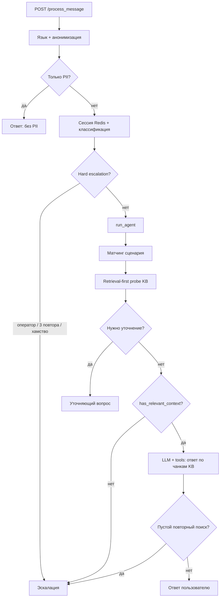

# Пайплайн агента Paynet

Полное описание обработки сообщения в режиме **thinking agent**: предобработка, сценарии, уточнения, гибридный RAG, жёсткие правила ответа и эскалация.

Связанные документы:
- [KB_RESTRUCTURE_TEMPLATE.md](KB_RESTRUCTURE_TEMPLATE.md) — структура базы знаний под метаданные
- [KB_MANAGEMENT_FEATURE.md](KB_MANAGEMENT_FEATURE.md) — загрузка и переиндексация PDF
- `scenarios/scenarios.json` — сценарии и уточняющие вопросы

---

## 1. Общая схема



Точка входа: `app/api/process.py` → `app/services/agent/orchestrator.py`.

---

## 2. Этап 1: предобработка (до агента)

Выполняется в `POST /process_message` до вызова `run_agent`.

| Шаг | Модуль | Описание |
|-----|--------|----------|
| Валидация | `process.py` | `chat_id` и `message` обязательны |
| Язык | `language.py` | Явный `language: uz\|ru` или детекция OpenAI |
| Анонимизация | `anonymization.py` | Маскирование PII; пустое сообщение → отказ |
| Сессия | `session.py` | История в `chat:{id}:messages` (до 10 реплик) |
| Повторы | `process.py` | Cosine similarity эмбеддингов; `count >= 3` → hard escalation |
| Классификация | `classification.py` | theme / category / subcategory |
| Hard escalation | `process.py` | См. таблицу ниже |

### Hard escalation (до агента)

Срабатывает **до** RAG и агента. Агент не вызывается.

| Условие | `escalation_reason` |
|---------|---------------------|
| Слова: `оператор`, `человек`, `operator`, `inson`, `odam` | `user_request` |
| 3+ похожих подряд сообщения (`SIMILARITY_THRESHOLD`) | `repeat` |
| Классификация «Хулиганство / Bezorilik» | `rudeness` |
| Категория из `auto_escalate_categories` в scenarios.json | `rudeness` |

Ответ: «Передаём оператору...» + `escalation_summary` для оператора.

---

## 3. Этап 2: состояние агента (Redis)

Ключ `chat:{chat_id}:agent_state` (TTL 1 ч):

```json
{
  "scenario_id": "qr_issue",
  "slots": { "user_type": "клиент" },
  "clarification_count": 1,
  "tools_used": ["search_knowledge_base"]
}
```

| Поле | Назначение |
|------|------------|
| `scenario_id` | Активный сценарий (фиксируется при первом матче) |
| `slots` | Ответы на уточняющие вопросы (`user_type`, `payment_channel`) |
| `clarification_count` | Сколько раз пользователь отвечал на уточнение |
| `tools_used` | Инструменты за текущий диалог |

История диалога: `chat:{id}:messages` — user + assistant, макс. `MAX_HISTORY_SIZE` (10).

Краткий контекст: `chat:{id}:context` — асинхронно обновляется после успешного ответа (не при эскалации).

---

## 4. Этап 3: сценарии

Файл: `scenarios/scenarios.json`  
Редактор: `/admin/scenarios`  
Код: `app/services/scenarios.py`

### Матчинг

`match_scenario(message)` — первый enabled-сценарий, чей `trigger` содержится в тексте (case-insensitive).

После матча `scenario_id` **закрепляется** в сессии до её сброса (эскалация / таймаут 1 ч).

### Поля сценария

| Поле | Описание |
|------|----------|
| `id` | Уникальный идентификатор |
| `triggers` | Ключевые фразы для матча |
| `clarify_policy` | `never` \| `if_ambiguous` \| `always` |
| `required_slots` | Слоты с вопросами RU/UZ |
| `search_hint` | Шаблон запроса в KB (`QR {user_type}`) |
| `default_audience` | `client` \| `agent` \| `both` |
| `default_channel` | `mobile_app` \| `agent` \| `infokiosk` |
| `topic` | Фильтр KB: `qr`, `payment`, `refund`, `sms`, ... |
| `max_clarifications` | Лимит уточнений (переопределяет глобальный) |

### Текущие сценарии

| id | Уточнения | Слот | default |
|----|-----------|------|---------|
| `qr_issue` | if_ambiguous, max 2 | user_type | client, topic=qr |
| `payment_failed` | if_ambiguous, max 2 | payment_channel | client, topic=payment |
| `refund` | if_ambiguous, max 2 | payment_channel | client, topic=refund |
| `sms_not_received` | never | — | client, mobile_app, sms |
| `infokiosk` | never | — | infokiosk, payment |
| `agent_payment` | never | — | agent, payment |
| `mobile_app` | never | — | client, mobile_app |

Глобальный лимит: `default_max_clarifications: 2`.

---

## 5. Этап 4: уточняющие вопросы

### Когда задаётся вопрос

Функция `_should_clarify()` в `orchestrator.py`:

1. Есть сценарий с `required_slots`
2. `clarify_policy != never`
3. Статус probe: `ambiguous` или `insufficient`
4. Есть незаполненные слоты
5. `clarification_count < max_clarifications`

### Политики `clarify_policy`

| Значение | Поведение |
|----------|-----------|
| `never` | Уточнений нет; сразу KB с default audience/channel |
| `if_ambiguous` | Вопрос только если KB пустая или неоднозначная |
| `always` | Вопрос при любом незаполненном слоте (независимо от KB) |

### Счётчик уточнений

- При ответе пользователя на уточнение (пока слот пуст) → `clarification_count += 1`, значение пишется в первый missing slot
- При `clarification_count >= max_clarifications` → эскалация `max_clarifications`
- На практике у каждого сценария **1 слот** → обычно **1 вопрос**, лимит 2 — запас

### Retrieval-first

**Сначала** поиск в KB, **потом** уточнение. Бот не спрашивает «клиент или агент?», если KB уже однозначно отвечает для `default_audience=client`.

---

## 6. Этап 5: гибридный RAG

Код: `app/services/search.py`, `app/services/agent/tools/search_kb.py`

### Retrieval-first probe (3 уровня)

В `_retrieval_first_probe()`:

1. **Узкий фильтр** — `build_metadata_filter(scenario, slots)` (audience + channel + topic)
2. **Без audience** — те же channel + topic
3. **Без фильтра** — полный поиск по всей БЗ

На каждом уровне:

- `has_relevant_context` → статус `sufficient`, стоп
- `is_ambiguous` → статус `ambiguous`, стоп
- иначе → следующий уровень

### Гибридный поиск (Qdrant + BM25)

| Параметр | Значение | Где менять |
|----------|----------|------------|
| RRF константа | `K = 60` | `search.py` → `RRF_K` |
| Vector top-k | 20 | `_hybrid_search_sync` |
| BM25 top-k | 20 | `_hybrid_search_sync` |
| Final top-k | 5 | `execute_search_kb` → `top_k=5` |
| min RRF score | 0.015 | `evaluate_kb_hits` в `kb_metadata.py` |

Алгоритм:
1. Qdrant — векторный поиск с `query_filter` по metadata
2. BM25 — текстовый поиск по чанкам
3. Объединение Reciprocal Rank Fusion (RRF)
4. Пост-фильтр `chunk_matches_filter` для BM25-fallback

Запрос нормализуется через синонимы: `normalize_text_with_synonyms(query, language)`.

### Метаданные чанков

При индексации PDF (`knowledge_base.py` + `kb_metadata.py`):

| Поле | Значения |
|------|----------|
| `audience` | `client`, `agent`, `both` |
| `channel` | `mobile_app`, `agent`, `infokiosk`, `general` |
| `topic` | `qr`, `payment`, `refund`, `sms`, `identification`, `general` |
| `section` | Заголовок раздела PDF |

Фильтр при поиске: `both` и `general` подмешиваются к любому audience/channel.

Подробнее о структуре PDF: [KB_RESTRUCTURE_TEMPLATE.md](KB_RESTRUCTURE_TEMPLATE.md).

### Оценка результатов (`evaluate_kb_hits`)

| Флаг | Условие |
|------|---------|
| `is_empty` | Нет hits |
| `is_sufficient` | top_score ≥ порога и ≤1 primary audience |
| `is_ambiguous` | top_score ≥ порога и client + agent в топ-5 |
| `has_relevant_context` | `is_sufficient && !is_empty` |

---

## 7. Этап 6: жёсткие правила ответа

Код: `app/services/agent/kb_guard.py`, `orchestrator.py`

### Правило KB-guard

**Без `has_relevant_context` — только уточнение или эскалация. Свободный ответ запрещён.**

| Ситуация | Действие |
|----------|----------|
| Probe `insufficient` / `ambiguous`, уточнение возможно | Уточняющий вопрос |
| Probe не sufficient, уточнение невозможно | Эскалация `no_kb_match` |
| Probe `sufficient` | Агентный цикл с чанками в system prompt |
| Повторный `search_knowledge_base` пустой | Эскалация `no_kb_match` |
| LLM вернул текст без `kb_context_confirmed` | Эскалация `no_kb_match` |
| Исчерпаны `MAX_AGENT_STEPS` | Эскалация `out_of_scope` |

### Промпт-правила (дополнительно)

`app/services/agent/prompts.py`:
- Только информация из KB
- Не выдумывать
- При отсутствии ответа — `escalate_to_operator`

### Температура

`AGENT_TEMPERATURE=0.2` — низкая вариативность для фактических ответов.

---

## 8. Этап 7: агентный цикл (LLM + tools)

Запускается **только** при `probe_status == sufficient`.

| Параметр | Значение |
|----------|----------|
| Модель | `AGENT_MODEL` (default: `gpt-4.1-mini`) |
| Temperature | `AGENT_TEMPERATURE` (default: `0.2`) |
| max_tokens | 600 (в коде) |
| tool_choice | `auto` |
| Макс. шагов | `MAX_AGENT_STEPS` (default: 5) |

### Инструменты

| Tool | Описание |
|------|----------|
| `search_knowledge_base` | Повторный поиск (query + metadata filter) |
| `escalate_to_operator` | Причины: `no_kb_match`, `max_clarifications`, `user_request`, `out_of_scope` |

Схемы: `app/services/agent/registry.py`.

В system prompt подкладываются найденные чанки probe. История: последние сообщения из `messages`.

---

## 9. Этап 8: эскалация

Код: `app/services/escalation.py`

### Причины (`escalation_reason`)

| reason | Источник |
|--------|----------|
| `user_request` | Hard guard: слова «оператор» |
| `repeat` | Hard guard: 3 похожих сообщения |
| `rudeness` | Hard guard / auto_escalate_categories |
| `no_kb_match` | Пустая или неоднозначная KB |
| `max_clarifications` | Лимит уточнений |
| `out_of_scope` | Исчерпаны шаги агента |

### Ответы пользователю

| Ситуация | RU |
|----------|-----|
| Обычная эскалация | «Передаём оператору. Пожалуйста, подождите.» |
| 3+ эскалации в сессии | «Высокая нагрузка... +998712020707» (`status: high_load`) |
| Ручная `/escalate` | «Чат передан оператору...» |

### Выжимка для оператора

`build_escalation_summary()` — LLM (`ESCALATION_SUMMARY_MODEL`) по последним сообщениям (до 10), классификации и agent_state. Fallback — шаблон без LLM.

---

## 10. Ответ API

`MessageResponse` (`app/models/schemas.py`):

| Поле | Описание |
|------|----------|
| `status` | `success` \| `escalation` \| `high_load` |
| `response` | Текст бота |
| `classification` | theme, category, subcategory (+ escalation_* при эскалации) |
| `escalation` | bool |
| `mode` | `answering` \| `clarifying` \| `escalation` |
| `tools_used` | `["search_knowledge_base", ...]` |
| `escalation_summary` | Выжимка для оператора |
| `escalation_reason` | Код причины |
| `history` | Тексты user-сообщений |

---

## 11. Настраиваемые параметры

### Переменные окружения (`.env`)

#### Агент

| Переменная | Default | Описание |
|------------|---------|----------|
| `AGENT_ENABLED` | `true` | Включить агентный режим |
| `AGENT_MODEL` | `gpt-4.1-mini` | Модель агента |
| `AGENT_TEMPERATURE` | `0.2` | Температура генерации |
| `MAX_AGENT_STEPS` | `5` | Макс. итераций tool loop |
| `KB_EMPTY_ESCALATE` | `true` | *Устарело:* эскалация при пустом RAG теперь всегда в коде |
| `ESCALATION_SUMMARY_MODEL` | `gpt-4o-mini` | Модель выжимки |
| `ESCALATION_SUMMARY_MAX_CHARS` | `1500` | Лимит длины выжимки |

#### Сессия и повторы

| Переменная | Default | Описание |
|------------|---------|----------|
| `MAX_HISTORY_SIZE` | `10` | Макс. реплик в истории / выжимке |
| `SIMILARITY_THRESHOLD` | `0.9` | Порог «повторного» сообщения для hard escalation |
| `CONTEXT_MAX_CHARS` | `2000` | Лимит контекста диалога в Redis |

#### RAG / эмбеддинги

| Переменная | Default | Описание |
|------------|---------|----------|
| `OPENAI_EMBEDDING_MODEL` | `text-embedding-3-small` | Модель эмбеддингов |
| `OPENAI_EMBEDDING_DIMENSIONS` | `1536` | Размерность вектора |
| `EMBEDDING_SEMAPHORE_LIMIT` | `20` | Параллельность эмбеддингов при индексации |
| `QDRANT_HOST` / `QDRANT_PORT` | localhost:6333 | Qdrant |
| `QDRANT_ALIAS` | `kb_current` | Alias активной коллекции |

#### Retry OpenAI

| Переменная | Default |
|------------|---------|
| `MAX_RETRIES` | `10` |
| `MIN_WAIT` | `1` |
| `MAX_WAIT` | `5` |

#### Пути

| Переменная | Default | Описание |
|------------|---------|----------|
| `KB_DIR` | `kb` | Каталог БЗ |
| `SCENARIOS_DIR` | `scenarios` | Каталог сценариев |

### scenarios.json (без перезапуска — hot reload по mtime)

| Поле | Описание |
|------|----------|
| `scenarios[]` | Список сценариев |
| `default_max_clarifications` | Глобальный лимит уточнений (2) |
| `auto_escalate_categories` | Категории для мгновенной эскалации |

Редактирование: `/admin/scenarios` — визуальный редактор (карточки сценариев + вкладка «JSON целиком») или прямое изменение файла.

### Параметры в коде (требуют деплоя)

| Параметр | Файл | Default |
|----------|------|---------|
| `RRF_K` | `search.py` | 60 |
| vector/bm25 top-k | `search.py` | 20 / 20 |
| final top-k | `search_kb.py` | 5 |
| `min_rrf_score` | `kb_metadata.py` | 0.015 |
| chunk size / overlap | `knowledge_base.py` | 800 / 100 |
| `max_tokens` агента | `orchestrator.py` | 600 |
| `OPERATOR_KEYWORDS` | `constants.py` | оператор, человек, ... |

---

## 12. Метрики Prometheus

| Метрика | Когда |
|---------|-------|
| `agent_steps_total` | Каждый шаг LLM-цикла |
| `agent_tool_calls_total{tool_name}` | Вызов tool |
| `agent_clarifications_total` | Уточняющий вопрос |
| `escalation_count_total` | Эскалация |
| `request_latency_seconds{endpoint}` | Латентность `/process_message` |

---

## 13. Типовые сценарии поведения

### QR не работает (клиент, есть чанк в KB)

1. Матч `qr_issue`
2. Probe с `audience=client` → sufficient
3. Ответ по чанку, без вопроса «клиент или агент?»

### QR не работает (KB пустая / не проиндексирована)

1. Probe insufficient на всех уровнях
2. Уточнение (если слот пуст) **или** эскалация

### Вопрос вне БЗ

1. Probe insufficient
2. Нет слотов для уточнения → `no_kb_match` → оператор

### SMS не приходит

1. Матч `sms_not_received`, `clarify_policy: never`
2. Probe с `mobile_app + sms`
3. Ответ или эскалация, без уточнений

---

## 14. Файловая карта

```
app/api/process.py              # HTTP, hard guards, вызов агента
app/services/agent/
  orchestrator.py               # Главный пайплайн
  kb_guard.py                   # probe_has_relevant_context
  prompts.py                    # System prompt
  registry.py                   # Tool schemas
  tools/search_kb.py            # RAG tool
  tools/escalate.py             # Escalation tool
app/services/search.py          # Hybrid Qdrant + BM25
app/services/kb_metadata.py     # Metadata, filters, evaluate_kb_hits
app/services/scenarios.py       # Сценарии
app/services/escalation.py      # Эскалация + выжимка
app/services/session.py         # Redis state
scenarios/scenarios.json        # Конфиг сценариев
kb/KB.pdf                       # Источник БЗ
kb/knowledge_base.json          # Чанки с metadata
```

---

## 15. Чеклист эксплуатации

1. Загрузить и проиндексировать БЗ: `/admin/kb`
2. Структура PDF по [KB_RESTRUCTURE_TEMPLATE.md](KB_RESTRUCTURE_TEMPLATE.md)
3. Проверить сценарии: `/admin/scenarios`
4. `AGENT_ENABLED=true`, `AGENT_TEMPERATURE=0.2`
5. Тест: вопрос вне БЗ → эскалация, не выдуманный ответ
6. Тест: вопрос в БЗ → ответ с `tools_used: ["search_knowledge_base"]`
